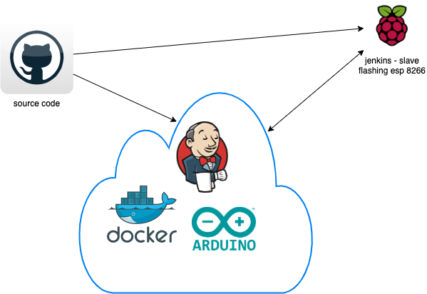

# Arduino ci/cd

the intention of this essembly is to have an automated build server that is able to compile and flash arduino project's.

## building blocks

### jenkins

[Jenkins](https://www.jenkins.io/doc/) is used as ci cd server the used plugins are documented here [plugins](docker/jenkins/plugins.txt).

### docker

[Docker](https://www.docker.com/) is used as cloud solution.

### arduino-cli

the [Arduino CLI](https://arduino.github.io/arduino-cli/latest/) is used to compile arduino projects.

### raspi

based on [Raspbian](https://www.raspbian.org/) a jenkins slave is integrated to be able to flash the resulting binary.

### github

is used to ship the code

## technical documentation

[technical documentation](documentation/technical_documentation.md)

[maybe for testing](https://github.com/Arduino-CI/arduino_ci)
